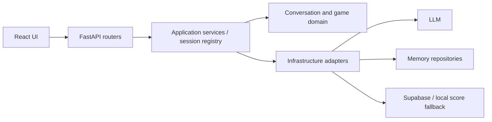

# AI Learning Service

AI 친구 대화, 학습 지원, 게임과 응답 평가를 연결하는 웹 프로토타입.

> 문서 검토본. 2026-09-15 본인 역할과 로컬 제출 보고서의 평가 근거를 보강했습니다.

## Why

대화 맥락과 학습 활동을 이어가기 위해 응답 생성 외에도 기억, 대화 타이밍, 세션 상태를 관리합니다. 학습 효과가 검증된 상용 서비스라는 주장은 하지 않습니다.

## What it does

- React 화면에서 대화·학습·게임 기능을 API로 연결합니다.
- FastAPI 라우트와 application/domain/infrastructure 계층을 분리합니다.
- Jiho의 장기기억 검색과 configurable agent의 namespace 메모리를 구분합니다.
- 별도 [autorater](autorater/README.md)에서 응답 데이터를 rubric으로 평가합니다.

## My Contribution

3인 팀에서 Jiho 대화 Agent, Teacher 학습 흐름, FastAPI·React 웹 서비스와 게임 구현을 담당했습니다. Isabella와 별도 Learning Friend 오토레이터는 팀원 기여로 구분합니다.

Jiho의 [기억·프롬프트 분리](https://github.com/hardlyPw/AI_HomeSchooling/commit/260829f), [세션 분리](https://github.com/hardlyPw/AI_HomeSchooling/commit/cd92b2e), [Teacher 학습 흐름](https://github.com/hardlyPw/AI_HomeSchooling/commit/f21e9c2), [그래프 게임](https://github.com/hardlyPw/AI_HomeSchooling/commit/141b4b7)을 구현했습니다. 팀원의 UI·통합 수정과 SFT 실험을 본인의 단독 저작·모델 학습 성과로 묶지 않습니다.

## Architecture



## Key Technical Decisions

- **세션 캐시:** [TTL과 최대 크기 제한](Backend/application/expiring_service_cache.py)으로 프로세스 내 runtime 수명을 관리합니다. 사용자 인증과 다중 worker 상태 공유는 별도 문제입니다.
- **기억 검색:** [JihoMemoryRepository](Agent/jiho_memory_repository.py)가 검색 후보를 관련성·중요도·최근성으로 재정렬합니다. 현재 설정의 품질 우위는 측정 결과로 확인해야 합니다.
- **장애 시 점수 처리:** [remote/local repository](Backend/infrastructure/repositories/resilient_score_repository.py)는 remote 오류 시 local 결과를 사용합니다. 실패한 쓰기를 영구 보존·재전송한다는 보장은 없습니다.

위 설명은 코드의 동작과 한계입니다. 실제 선택 동기·대안 검토는 [NEEDS VERIFICATION]입니다.

## Results

제출 보고서와 원본 로그에서 **장기기억 평가와 단계별 응답 시간 측정**을 확인했습니다.

| 평가 | 조건 | 결과 | 해석 범위 |
|---|---|---|---|
| 장기기억 | 150세션 이후 과거 사건 10문항, 제출용 평가표 기준 | 정답 4 · 부분 3 · 오답 3 | 소규모 내부 시나리오 평가. 실제 학생의 학습 효과나 일반 정확도가 아님 |
| 응답 시간 | 보고서상 1,500턴 누적 DB, 같은 세션의 연속 7턴 서버 로그 | total 평균 **4.64초**, 범위 **3.63–5.41초**; 기억 검색 평균 **0.329초** | 당시 환경의 관측값. 부하 시험·현재 revision의 성능 보증·개선율이 아님 |
| 페르소나 개선 | 보고서의 v1→v4 반복 실험 | 응답 예시를 넣은 v2에서 문구 재사용 문제를 관찰하고, v4에서 금지 표현 규칙 적용 | 보고서의 정성 관찰. 최종 버전의 정량 개선율은 제시하지 않음 |
| 코드 검증 | 2026-09-14 감사, 기존 6개 단위 테스트 모듈 | **23개 통과** | fake client를 포함한 로직 검증. 외부 LLM·Supabase E2E와 구별 |

검색 후보에 정답이 있었는데 최종 응답이 기억하지 못한다고 답한 실패 사례를 확인했습니다. 검색과 답변 생성의 실패를 나누어 설명할 수 있다는 점이 핵심 결과입니다.

보고서의 `first_delta`는 코드상 응답 생성 호출부터 첫 출력까지의 시간입니다. 요청 전체의 첫 토큰 지연으로 쓰지 않습니다. 비교 서비스의 실험 조건도 동일성이 확인되지 않아 ‘ChatGPT 대비 10배’ 같은 표현을 사용하지 않습니다.

로컬 시연 영상과 본선 발표 자료가 존재합니다. 영상 재생 내용, 실제 학생 대상 이용 규모·학습 효과, 수상 여부는 미확인입니다.

근거: 로컬 제출 보고서 6·7장, `experiment_10case_evaluation.md`, `DB 검사 저장_원본백업.txt`. 원본은 저장소에 추가하지 않았으며 공개 증빙 URL은 아직 없습니다.

## Getting Started

Python과 Node.js가 필요합니다. dependency 버전이 고정되지 않은 Python 항목이 있으므로 완전한 재현 환경은 추가 정리가 필요합니다.

```powershell
python -m venv .venv
.\.venv\Scripts\Activate.ps1
pip install -r Backend/requirements.txt
```

`Agent/.env.example`, `Backend/.env.example`를 참고해 별도 로컬 환경변수를 구성합니다. 실제 키는 commit하지 않습니다. Supabase 기억 테이블/RPC 등 외부 스키마가 필요하며 [SQL 설명](Backend/sql/README.md)만으로 모든 외부 설정이 복원된다고 보장하지 않습니다.

```powershell
# backend: repository root에서 시작
cd Backend
python -m uvicorn main:app --reload --port 8000
```

```powershell
# 별도 terminal: repository root에서 시작
cd frontend
npm ci
npm run dev
```

이 시작 절차는 코드·설정 기반 안내이며 이번 문서 감사에서 전체 서비스 실행은 검증하지 않았습니다. 모델/API 사용은 별도 환경·비용이 필요합니다.

## Project Structure

- `Agent/`: Jiho runtime, prompt, memory, scenario 도구
- `Backend/`: API, application, domain, infrastructure, SQL, 기존 tests
- `frontend/`: React/TypeScript 화면
- `autorater/`: 별도 응답 평가 데스크톱 도구

## Testing / Evaluation

```powershell
cd Backend
python -m unittest tests.test_expiring_service_cache tests.test_friend_session_registry tests.test_conversation_policy tests.test_agent_definition tests.test_jiho_memory_repository tests.test_current_games -v
```

기억 repository 테스트는 fake embedding/Supabase/LLM client를 사용합니다. E2E·성능·교육적 효과 실험과 구별해야 합니다. 평가 계획을 실행 성과로 표기하지 않습니다.

## Limitations

- 단일 사용자 프로토타입 DB와 인증/행 소유권 정책의 미완료 범위는 SQL 문서 참조.
- 빈 friend session ID는 default로 모입니다. 익명 상태에서 사용자 격리를 보증하지 않습니다.
- namespace별 in-memory 저장과 Jiho Supabase 경로는 서로 다른 구현입니다.
- 전체 서비스 배포·외부 스키마 재현·사용자 효과는 검증 필요.

## Links

- [Response evaluation tool](autorater/README.md)
- [Database setup notes](Backend/sql/README.md)
- Portfolio / Demo: [NEEDS VERIFICATION]
